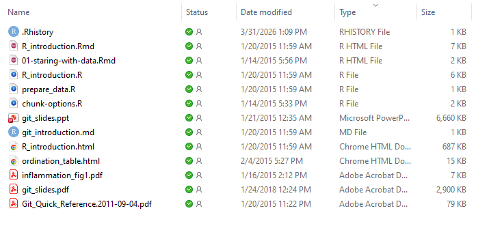

Home Page - http://dmcglinn.github.io/quant_methods/ 
GitHub Repo - https://github.com/dmcglinn/quant_methods 

Very few students get excited about file types yet they are critical
to understand if you are going to be successful as a quantitative scientist.
Specifically, you should be able to: 

- Identify what type of file is being used by examining a file extension, 

- Understand the pros / cons of various file types, and

- Understand how to convert files from one type to another. 

One immediate obstacle to making progress towards these goals is that your 
computer's operating system may be hiding file extensions from your view 
by default. To check this take a look at a folder of your files. You 
should see file extensions at the end of each file name: 
 

In that folder you can see that there are several R markdown files (`.Rmd`), 
several R scripts (`.R`), a powerpoint file (`.ppt`), and a few other file types.
Each file type is obvious because you can see the file extension at the
end of the file name after a dot. 

If you do NOT see these on your own computer that is because your OS is 
hiding the file extensions from you. You need to go ahead and make these visible 
by following the instructions at the following links: 

- [PC Instructions](https://support.microsoft.com/en-us/windows/file-explorer-in-windows-ef370130-1cca-9dc5-e0df-2f7416fe1cb1)
- [MAC Instructions](https://support.apple.com/guide/mac-help/show-or-hide-filename-extensions-on-mac-mchlp2304/mac)

In the course materials I have provided, the vast majority of files fall under
and umbrella file type called a plain text file. Plain text files only contain
unformatted characters —no bolding, fonts, or images—making it universally
compatible, lightweight, and ideal for coding, configuration, or
distraction-free writing.

If you are familiar with plain text files then you may also be aware that on
the PC the default plain text file extension is `.txt`. So for example `code.txt` 
refers to a file called `code` that can be opened using a plain text editor. 

Other file formats such as `.xlsx`, `.pdf`, and `.docx` cannot be opened 
in a plain text editor because they require special instructions to be
rendered that only specific software can accomplish such as Excel, Adobe, and
Word applications respectively. 

In general, it is best to store code and data in a plain text file format
because you can guarantee it will always be able to be opened without any issues
in the future (50 or 100 years from now). 

Here are a list of core file types in these course materials and some of their
key attributes. 

| File Extension | Plain text | File Type            | Function                                                                                                                                          |
|----------------|------------|----------------------|---------------------------------------------------------------------------------------------------------------------------------------------------|
| .R             | yes        | R script             | Contains R code (e.g., for an analysis)                                                                                                           |
| .Rmd           | yes        | R markdown           | Combines R code with the output from the  R console with text that can be rendered (i.e., knit) into other formats such as .docx, .pdf, or .html. |
| .Rhistory      | yes        | R history            | Contains a record of all the commands executed in the R console                                                                                   |
| .Rproj         | yes        | R project            | Used by RStudio to manage a specific project (typically you don't edit this file)                                                                 |
| .Rdata         | no         | R data               | Compressed file of an R object(s) - it may one or many R objects. Import with `load()` and export with `save()`                                   |
| .xlsx          | no         | Excel spreadsheet    | A proprietary file type that is not suggested for longterm data accessibility                                                                     |
| .csv           | yes        | comma seperated file | Typically a spreadsheet in which each column is separated by a comma                                                                              |
| .md            | yes        | markdown file        | A simple way to generate a nice webpage ([the page your reading right now for example](https://raw.githubusercontent.com/dmcglinn/quant_methods/refs/heads/gh-pages/lessons/file_types.md))                                                                                   |
| .html          | yes        | webpage              | Viewable in an internet browser                                                                                                                   |
| .docx          | no         | Word document        | A priorietary file type for editing documents - not suggested for longterm documentation                                                          |
| .pdf           | no         | pdf                  | A vector based document.                                                                                                                          |

Another important feature of plain text files is that the file extension 
can be changed on that file type without "breaking" those kinds of files. 
So for example you can change a markdown file into an Rmarkdown file 
simply by renaming the file from `myfile.md` to `myfile.Rmd`. The same cannot
be said for non-text files such as those listed in the table above. 

Rmarkdown files (`.Rmd`) have a special function in that they take plain 
R code and render it with text into an `.html`, `.doc`, or `.pdf` file. This is
primarily helpful if you would like to communicate both the code and results
to collaborators, for completing HW where you want to show your work, and 
for taking a snapshot of the results of your code and data at a specific moment
in time. 

## Be Aware
The Windows and Mac machines will sometimes attach the file extension `.txt` to files
when you download them from the internet. So for example if you try to download
a file called `mycode.R` it may rename this file `mycode.R.txt`. If that happens
just rename the file by dropping the `.txt` part of the file name.

Home Page - http://dmcglinn.github.io/quant_methods/ 
GitHub Repo - https://github.com/dmcglinn/quant_methods 