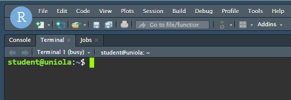
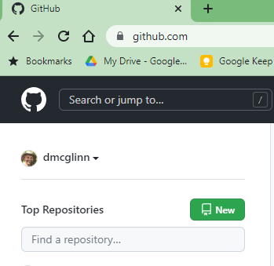
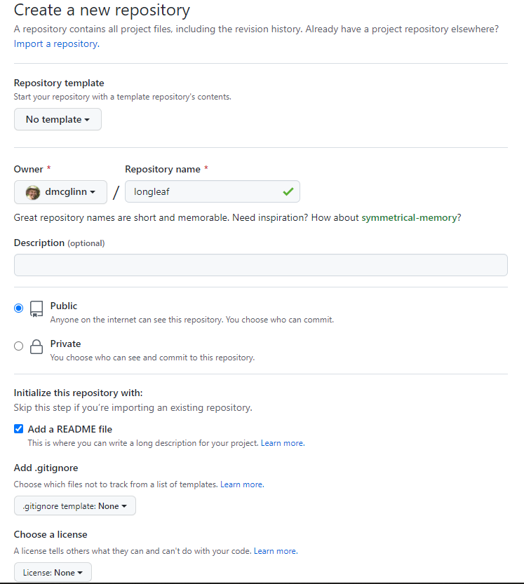
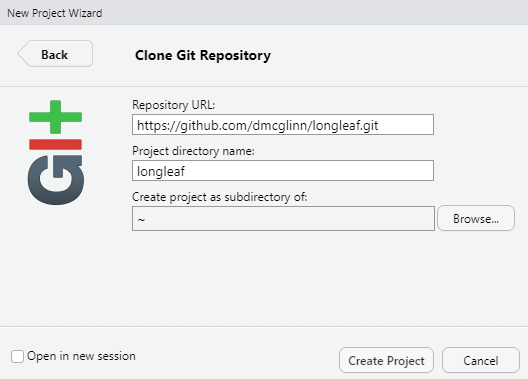
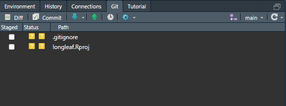

The purpose of this lesson to start using Git and GitHub from the command line
and within R studio.

To complete the GitHub portion of this lesson you will need to create a 
GitHub user account: https://github.com/ 

Git is a version control system that allows you to track changes to your data
and source code as you develop quantitative projects. It is common when 
working on a project to accrue many different versions of data and code files. 
git provides a system of organizing these file versions into a powerful 
reference system.


### Install Git

* Download Git for your OS here: 
<https://git-scm.com/download>

* Note: Mac users you may already have git installed on your OS.
Open your terminal and type `git` and see if you get an error. 

* Note: some Mac users have found these step-by-step install instructions 
helpful <https://codeburst.io/installing-git-for-the-first-time-on-mac-osx-bf9c513af2b8> 

### Configure Git within Rstudio 
For most Rstudio will automatically figure out where git is located, but for
others you will need to do this manually. Follow these steps

1. Click Tools > Global Options
2. Click Git/SVN 
3. Find the box labled "Git executabile" and browse to the directory on your
machine where this file is located. On my windows machine this is 
`C:\Program Files (x86)\Git\bin`

### Configure your git user name

You will need to configure your git user name the first time you use it on a 
machine. This is a pretty simple process.

1. Open a terminal window. You can do this in Rstudio by either navitagating to 
the window called "Terminal" usually right next to the console or by clicking: 
Tools -> Terminal -> Move focus to terminal



2. Set a Git username: 
```
$ git config --global user.name "Mona Lisa"
$ git config --global user.email "mona@gmail.com"
```

3. Confirm that you have set the Git username correctly:
```
$ git config --list
Output
user.name=Mona Lisa
user.email=mona@gmail.com
```
### Configure GitHub

GitHub continues to change its user policies and authenication methods on a 
yearly basis. Currently (2003) there are several setps that you need to complete
to make sure you can log in and remotely push code to github. 

1. create a free user account at http://github.com 
    - chose a username that you would feel happy going on your CV to potential employers. 

2. configure the two factor authentication within your github account
    - lots of options here I recommend either sms txt message or Microsoft
    authenticator phone app (should already have an account with your g.cofc.edu
    address). Just make sure you can log into github.com without hitting a snag.
3. configure a secure way to push code to github. 
    - The service does not allow you to use a simple password so there are least
    two simplish options. I will be using a personal access token in class
    (because my rstudio server only allows this option) but you may prefer to
    setup an ssh key. You can think of these two methods as just very fancy
    passwords. The personal access token can be used from any machine but its
    the kind of thing you have to copy and paste (its long) whereas the ssh key
    is specific for a specific machine but once you set it up you never have to
    think about it again 😮. I would use the ssh tokens if I could.  I'll
    provide the instructions here for both approaches here:
    -  [personal access token (classic) instructions](https://docs.github.com/en/authentication/keeping-your-account-and-data-secure/creating-a-personal-access-token#creating-a-personal-access-token-classic)
        i. be sure to set the expiration date to never and click all the boxes
        in the scopes options you want to be able to do any of those tasks with
        your token - they are crazy about security on github
        ii. once it is created save this long text string somewhere you can
        access when you need to make remote change to github (i.e., through
        Rstudio) - it will serve as your "password" - its confusing because you
        have a separate github account password 🙁
    - [ssh token full instructions](https://docs.github.com/en/authentication/connecting-to-github-with-ssh/generating-a-new-ssh-key-and-adding-it-to-the-ssh-agent) 
        i. open terminal
        ii. paste the following command into the terminal substituting the email
        address you used for your github account: 
        `ssh-keygen -t ed25519 -C "your_email@example.com"`
        This creates a new SSH key, using the provided email as a label.
        iii. When you're prompted to "Enter a file in which to save the key", you can
        press Enter to accept the default file location. 
        iv. paste one of the following commands in the terminal depending on
        what OS you are using:
        Mac:                `$ pbcopy < ~/.ssh/id_rsa.pub`
        Linux (Ubuntu):     `$  cat ~/.ssh/id_rsa.pub`
        Windows (Git Bash): `$ clip < ~/.ssh/id_rsa.pub`
        that will copy the ssh key to your clipboard now navigate your web-browser to:
        https://github.com/settings/ssh/new
        v. Paste the key into the box called "Key" in the box title - provide a name
        that will help you recognize the specific machine you are on - as I noted each
        machine you use will need a separate ssh key.
        vi. Click the green box "Add SSH key"

### Typical Rstudio, Git, and GitHub work flow

Congratulations! If you've made it this far you have successfully configured
Rstudio, git, and github - no small accomplishment! Now we're ready to start
doing work with these tools in concert. Each tool has a different role:

1. git - the program that creates the versions of the data and code
2. Rstudio - provides a GUI (point and click) interface for using git (as an
   alternative to at the command line)
3. GitHub - provides a web archive of the code if your machine dies or is lost

The standard workflow that we will work though now is: 

a. create a repo on GitHub with a blank README.md file for a new project that you want to undertake
b. clone (i.e., download) the repo to your local machine using Rstudio Project interface
c. make changes to repo by adding code and data
d. commit your changes locally
e. push (i.e., upload) your changes to GitHub via Rstudio GUI
f. repeat steps d and e as needed. 

**Note**:  if you make any changes to the GitHub repo either on another machine or in
the web browser then you'll want to "pull" those changes down to your local 
machine you're working on before making new local changes. Failure to do this 
will result in files that are not-synced up. If you use dropbox this is called 
a conflicted copy - two versions of a file but the software isn't sure which is 
the version that is most appropriate. 

### a. Create your new repo on GitHub

Good news you just got funded to study longleaf pine forests - time to setup a new 
github repo to kick off the project. 

1. go to github.com and click "New" on the list of repositories on the left


2. name your repo something informative like "longleaf"


Be sure to click "Add a README file" - this makes things easier downstream

Click green button "Create repository"

### b. Clone your repo to your local machine

1. Now that you have created your new repo you'll need to clone it to your 
local machine so you can start adding data and code to it. 

Click the Green button called "<> Code"

What you chose next will depend on if you chose to work with personal access
tokens or the ssh key for authentication into github. 
i. personal access token -> "HTTPS" option
ii. ssh -> "SSH" option

Click the little window button next to the url this will "copy" that url to your
clipboard. 

2. On your local machine open Rstudio and click: 

File -> New Project

When the next window pops up chose "Version Control"


Then chose "Git"


Now paste in the url for the github repo (that you have on your clipboard)
into the box for "Repository URL:"



Click "Create Project"

You've just cloned your first repo! 

You'll now notice in Rstudio you have a little tab called "Git"



### c. Make changes to repo by adding code and data


### Version control with Git
We will work through the SWC lesson's on Git
[Version Control with Git](http://swcarpentry.github.io/git-novice/)

In particular we will focus on:

* [Setting Up Git](http://swcarpentry.github.io/git-novice/02-setup/index.html)
* [Creating a Repository](http://swcarpentry.github.io/git-novice/03-create/index.html)
* [Tracking Changes](http://swcarpentry.github.io/git-novice/04-changes/index.html)
* [Exploring History](http://swcarpentry.github.io/git-novice/05-history/index.html)
* [Ignoring Things](http://swcarpentry.github.io/git-novice/06-ignore/index.html)
* [Remotes in GitHub](http://swcarpentry.github.io/git-novice/07-github/index.html)
* [Using Git from RStudio](http://swcarpentry.github.io/git-novice/14-supplemental-rstudio/index.html)

### Important Note:
If you setup an Rstudio project in a directory that was not a git directory then 
Rstudio will not recognize that it is a git directory until you create the 
Rstudio project. This is not difficult just follow the instructions for 
"Using Git from Rstudio" which is above.

## Optional text editor checks - if you will use git from the command line (less common)
### Windows Users
It is a good idea that you ensure that you have a text editor that can be run
from the terminal. Newer installs of git ship with an editor called nano
In the bash terminal type `nano` and hit Enter. 
If this does not bring up a text editor window in the terminal then you will
need to reinstall git and chose to use the nano editor for commit messages. Alternatively you can download nano directly from here: 
<http://www.nano-editor.org/dist/v2.2/NT/nano-2.2.6.zip>
Unzip the file and paste the files that have either a .exe or .dll extension
in the directory: `C:/Windows/System32/`

If none of the files appear to have a .exe file ending look for the file called
`nano` (this also indicates to me that you must have the default windows
option of hiding file extensions active - go turn it off when you get a chance).

Restart the terminal and try the command `winpty nano test.txt` If everything
is working this will create a file called `test.txt` in your working directory 
for you to edit within the terminal. 

If that still does not work not to fret you can always use the native text editor
on Windows called `notepad`. 
In the terminal simply type `notepad test.txt` to create a text file called
`test.txt` for you to edit in a GUI interface (i.e., not within the terminal window). 
Hit `Cntrl - c` at the terminal command prompt to close `notepad`. 

### Mac Users
Your OS may ship with the nano text editor. To examine if it is already 
functional on your machine. Open the terminal and type `nano` and hit Enter.
If is is not installed then I recommend you try Text wrangler: 
<http://www.barebones.com/products/textwrangler/>

### Setting up Git Instructions
<https://swcarpentry.github.io/git-novice/02-setup/>

### Additional Links
* [Motivation to learn Git](https://stat545-ubc.github.io/git01_git-install.html#but-first-why)
* [Git in Rstudio walkthrough by H. Whickham](http://r-pkgs.had.co.nz/git.html)


