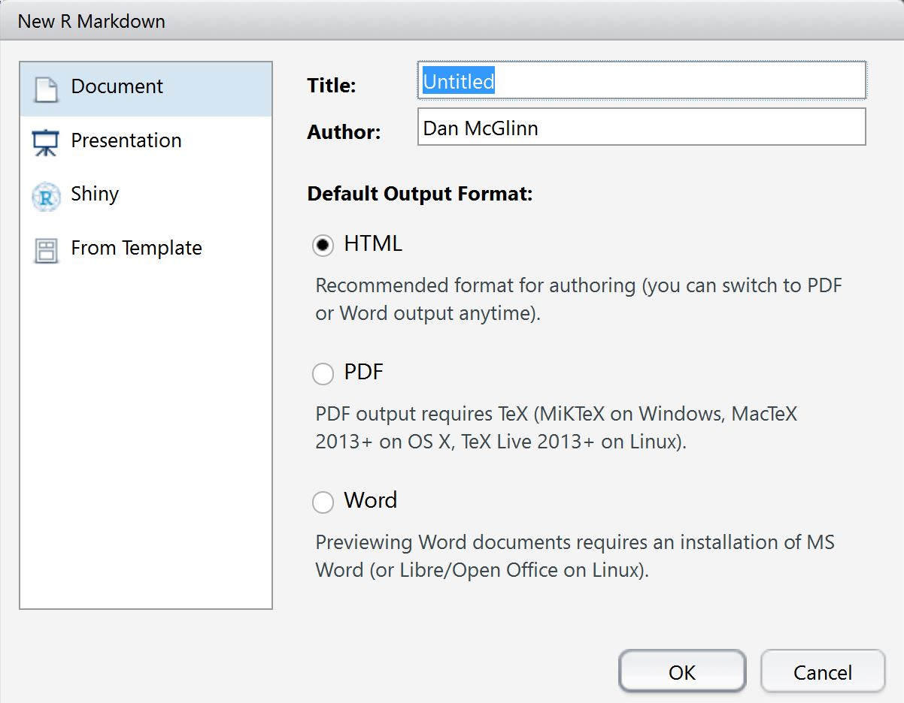
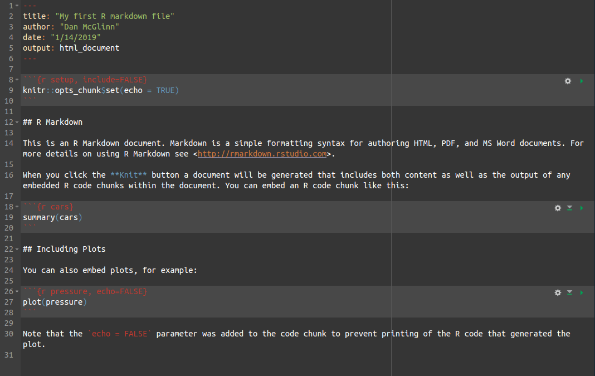
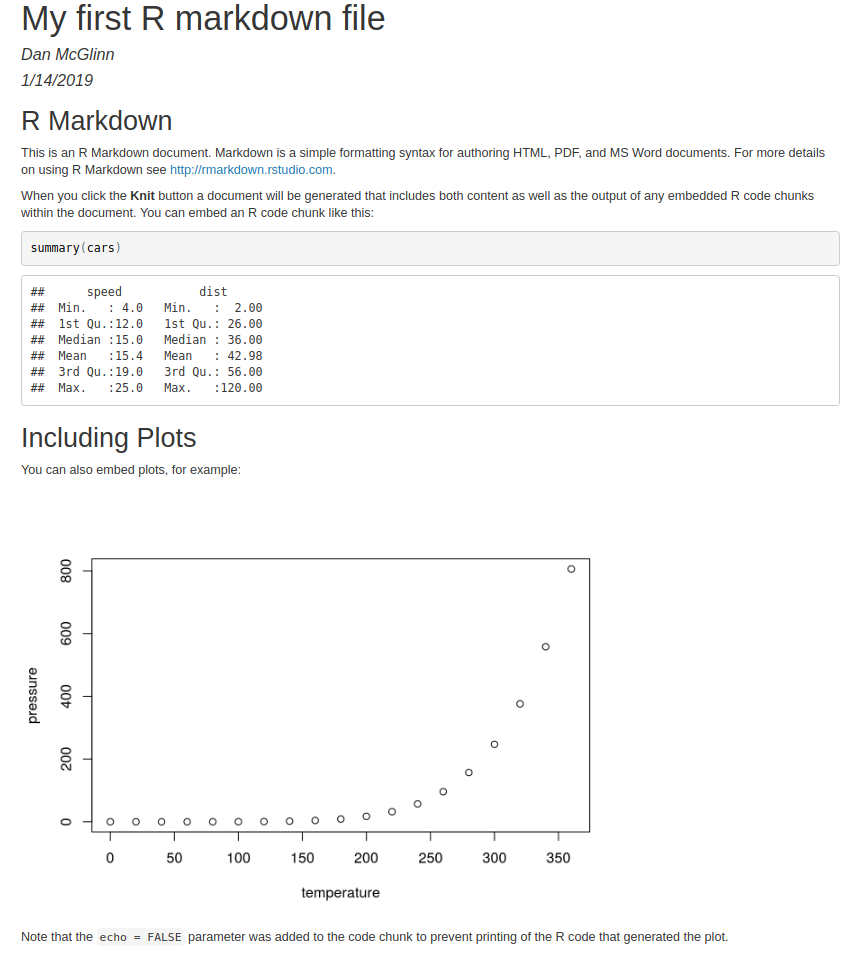

R markdown is a convenient and professional way to communicate about R code and
your statistical results in a single document. An R markdown file is just a
plain text file but it has the file extension .Rmd. R markdown files represent
the combination of a markdown file (.md file) and an Rscript (.R file).
[Markdown](http://daringfireball.net/projects/markdown/basics) is a simple set
of tags that allow for formatting of text it was designed to be very simple and
intuitive. There are lots of resources online about how to use markdown tags to
format plain text. Here is a good one <http://rmarkdown.rstudio.com/>

One of the best learning resources I've found on how to use R markdown document
is by [Karl Broman](https://kbroman.org/): <https://kbroman.org/knitr_knutshell/>
I also recommend that you work through this short demonstration
<https://rmarkdown.rstudio.com/articles_intro.html> by the folks at Rstudio.

What follows just touches more on the mechanics of working with R markdown docs in Rstudio
which I have noticed the above links have less information on. 

## How to create an R Markdown file in Rstudio

To create an R markdown file simply click on **File** > **New File** > 
**R Markdown**. 
If this is your first time ever creating an R markdown file you will be prompted
to install the necessary dependencies. 
Rstudio should take care of this for you but in rare instances will result in
errors that need to be chased down via Google searches. 
If errors persist I suggest completely removing the R markdown libraries from
your hard drive and then attempting to re-install them fresh. 

If their are no errors with installing the R package dependencies you will see a 
dialogue box that provides you with a number of different output formatting options:



By filling out the interactive dialogue box shown above you will pre-populate
your R markdown (.Rmd) file with those pieces of information. 

Notice in the dialogue box shown above that that if you chose to export to a pdf
additional dependencies are required.  
Specifically: _*PDF output requires TeX (MiKTeX on Windows, MacText 2013+ on OS X, TeX Live 2013+ on Linux).*_

If you attempt to compile a pdf without installing these additional dependencies
you will receive fairly informative errors that provide download links and 
specific instructions for how to get the correct dependency. You can avoid
installing these additional dependancies for the time being by simply requesting
to build an html document rather than a pdf. See the section bewlow on Troubleshooting
if you have trouble building to a pdf. 

## How to knit an R markdown document

When you create an R markdown file in R studio it is prepopulated with a file that
looks like this. 



This is prepopulated information is meant to demonstrate how one can use an R
markdown file. Before we talk about each piece of this document let's simply 
try to "knit" (i.e., compile) the document into the output of our choice (e.g., 
html, pdf, or doc). 

Click on the "Knit button"  that appears at the 
top of the script panel. This will prompt you to save the file. Be sure to name
your file with the .Rmd file extension which indicates that it is an Rmarkdown 
file. If the document compiles properly you should see a
document that looks like this: 



## Understanding the components of an R markdown doc

Let's go back through the .Rmd file we created and examine what line accomplishes:

First we have the header lines denoted by `---`

<pre>
---
title: "My first R markdown file"
author: "Dan McGlinn"
date: "1/14/2019"
output: html_document
---
</pre>

Upon knitting this information is used to generate a title and subtitle of the
document. It also specifies what kind of a document will be generated in this
case `html document` generates an html file. if you want to change the document
output you can just change `html_document` to `pdf_document` or `word_document`

Next we have 

    ```{r setup, include=FALSE}
    knitr::opts_chunk$set(echo = TRUE)
    ```

which is an R code chunk. This is R code that will be run when the document is
knitted. Let's break down the parts of this code chunk. First you have the
<pre>```</pre> which indicate that a code chunk is starting. The curly bracket
`{` indicates the start of specifying the code chunk options. The little `r`
indicates the language of the software in this case R. The next word `setup` is
the name of this code chunk this can be any thing you want or left blank. Naming
code chunks just makes it easier to navigate your R markdown script. After the
chunks name you have `, incude = FALSE` this is where the option of the chunk is
specified. There is a wide range of options you can specify
<https://yihui.name/knitr/options/?version=1.1.383&mode=server> The option
`include` does the following:

>include: (TRUE; logical) whether to include the chunk output in the final
output document; if include=FALSE, nothing will be written into the output
document, but the code is still evaluated and plot files are generated if there
are any plots in the chunk, so you can manually insert figures; note this is the
only chunk option that is not cached, i.e., changing it will not invalidate the
cache
The next link of the code chunk has some R code `knitr::opts_chunk$set(echo =
TRUE)` if you want to see what that does you could used `?knitr::opts_chunk` in
the R console to pull up the document that for that function. Essentially what
this line of R code is doing is setting global options for all code chunks
rather than specifying options for each chunk individually as `include = FALSE`
did above.
Note above that the code in an R code chunk can always be evaulated inline
(rather than using the knit button) by clicking on the little green trianage on
the code chunk or by using Cntrl-Enter to copy, paste, and run the line in the R
console.

## Setting R markdown's root directory

An additional useful global option that I sometimes like to set is the root directory of the script.

    ```{r setup, echo=FALSE}
    # setup the R enviornment for kniting markdown doc properly
    knitr::opts_knit$set(root.dir='../')
    ```

By default if this option is not set when you knit the file it will expect all file pathes to be relative
to where the R markdown file is saved. I often use a file structure which looks like the following:

```
my_project_dir
    data 
        my_data.csv
    scripts
        my_code.Rmd
    figures
    results
``` 

If I'm working with `my_code.Rmd` and I want it to import `my_data.csv` and I use `my_data <- read.csv('./data/my_data.csv')`
I will get an error message when I knit `my_code.Rmd` because it will assume that `./data/my_data.csv` is located in 
`my_project_dir/scripts/` because that is where `my_code.Rmd` is saved at. To fix this I can simply run 

## Troubleshooting: Rendering a pdf using Rmarkdown

### Installing MiKTeX on PC
Unfortunately, although the R error instructions where helpful I still had
to hack around to get this to work on my PC. Here are steps I had to take 

1) download installer at this address <http://miktex.org/download> and run install
2) R markdown still would not compile to pdf because of missing *.sty files
3) Error messages from the Rmarkdown console and a little bit of Googling
suggested the following additional MiKTeX packages needed to be installed
`framed` and `titling`. 
Luckily it is relatively easy to use the MiKTex Package Manager to install these additional two packages. Go ahead and do that.
4) turn off Rstudio and then turn it back on and you should be able to compile
your .Rmd file into a beautiful .pdf file (hopefully fingers crossed)

### Installing MacText 2013+ on OS X
These instructions were useful as of 01/2016.
There are two versions of MacText available online at
<http://www.tug.org/mactex/index.html>. 
One of the versions is very large (2.5GB) but a slimmed down version of the 
program is also available known as BasicTeX. 
These instructions will follow the route of using the smaller install of BasicTex.

1) download the BasicText installer: 
<http://tug.org/cgi-bin/mactex-download/BasicTeX.pkg> and run install
2) install missing *.sty files `framed.sty` and `titling.sty` by running the
following in your terminal

```
sudo tlmgr update --self
sudo tlmgr install framed
sudo tlmgr install titling
```

When using sudo you will be prompted for a password this is just your administrative
password on your machine.
If you don't know how to access mac's terminal simply search for it or use 
Rstudio's terminal by clicking **Tools** > **shell**

3) turn off Rstudio and then turn it back on and you should be able to compile
your .Rmd file into a beautiful .pdf file (hopefully fingers crossed)

## Additional topics to add
* error handling and warnings
* running code internally 
