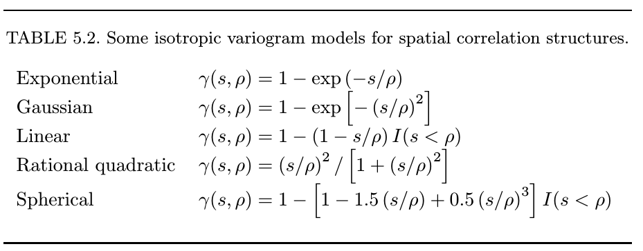
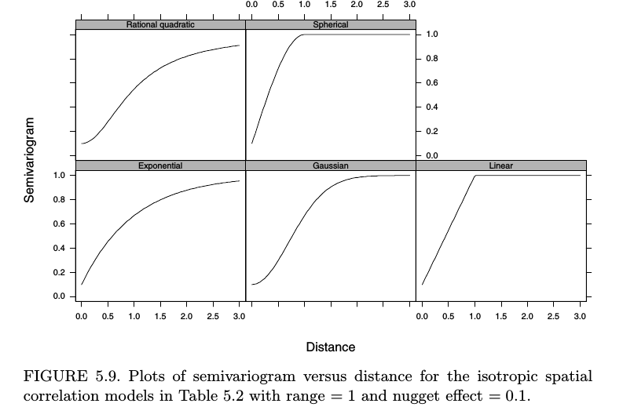

The goals of this lesson are to introduce how spatial dependence is tested 
for and how it can be corrected for or explained in uni- and multi-variate 
modeling frameworks. 

## Readings

* The R Book p778-785 on Generalized Least Squares models with spatially
correlated errors
* Numerical Ecology in R, p228-238 on detecting spatial dependence.

## Outline

* Spatial autocorrelation and induced spatial dependence
* Detecting a spatial signal
* Univariate modeling
* Multivariate modeling

## Spatial autocorrelation and induced spatial dependence

There are two general reasons why spatial dependence may 
exist in a response variable.

1) autocorrelation - the variable is simply inherently aggregated due its own
internal dynamics. In ecology this is sometimes referred to as a false gradient

2) induced spatial dependence: the variable is inherently spatially structured 
but the driving factors that it responses to are. In ecology this is sometimes
referred to as a true gradient

There is no statistical way to distinguish false from true gradients.

## Detecting a spatial signal

```{r}
library(vegan)
library(nlme)
# Oribatid mite data. 70 soil cores collected by Daniel Borcard in 1989.
# See Borcard et al. (1992, 1994) for details.
data(mite)
data(mite.env)
data(mite.xy)

head(mite)
head(mite.env)
head(mite.xy)
```
```{r}
plot(mite.xy)

sr = apply(mite, 1, function(x) sum(x > 0))
hist(sr)

plot(mite.xy, cex=sr/max(sr))

col_brks = hist(sr, plot=F)$breaks
col_indices = as.numeric(cut(sr, col_brks))
cols = rev(terrain.colors(length(col_brks)))
plot(mite.xy, cex=2, pch=19, col=cols[col_indices])
```

Visually it appears that low richness sites (i.e., brown circles) are more 
likely to be near other low richness sites - this indicates a pattern of 
spatial dependence. We can carry out some very simple analyses to
examine if this relationship is stronger than we would expect under a 
null model of randomly shuffled spatial positions. Our test statistic in this 
context is the Pearson correlation coefficient between the difference in the
response variable (i.e., richness) and the difference in spatial proximity. 

```{r}
# calculate Euclidean distance between richness and spatial coordinates
sr_dist = dist(sr)
xy_dist = dist(mite.xy)

# for interpretation purposes a rule of thumb is not to interpret distances
# great than 1/2 the maximum distance in the dataset. This is to avoid
# examining spatial patterns that are underlaid by only a few samples. At
# small to intermidate distances there are typically many more pairs of samples
# where as at the extreme ends of a sampling grid there are only two sets of
# samples (i.e., those that lie along the two diagonals corners from one another)

max_dist = max(xy_dist) / 2

# plot result
plot(xy_dist, sr_dist)
abline(lm(sr_dist ~ xy_dist), lwd=3, col='red')
lines(lowess(xy_dist, sr_dist), lwd=3, col='pink')
abline(v = max_dist, col='red', lwd=3, lty=2)

# compute correlation
obs_cor = cor(xy_dist, sr_dist)
obs_cor

# carry out a permutation test for significance:
nperm = 1000
null_cor = obs_cor
for (i in 2:nperm) {
    # shuffle the rows of the spatial coordinates
    tmp_xy = mite.xy[sample(nrow(mite.xy)), ]
    # correlation between the shuffled spatial coordinates and sr_dist
    null_cor[i] = cor(dist(tmp_xy), sr_dist)
}
# compute the p-value
sum(null_cor >= obs_cor) / nperm 

# carry out the same analysis using the function mantel()
sr_mantel = mantel(xy_dist, sr_dist)
sr_mantel

# compare the two approaches graphically using stacked boxplots
boxplot(list(null_cor, sr_mantel$perm), horizontal = T, boxwex = 0.5,
        names = c('mine', 'theirs'), xlab='Correlation')
abline(v=obs_cor, col='red')

# as expected they look almost identical and the observed value is 
# much larger than then null realizations indicating that there is a 
# signficant difference between the observed spatial pattern and one due to
# random chance.
```

This preliminary analysis suggests that there is a significant relationship 
between the spatial distance that two points are separated and the difference
in species richness of the points. We can undertake a similar approach to 
examining a multivariate response variable such as species composition

```{r}
## compute bray curtis distance for the community matrix
comm_dist = vegdist(mite)
plot(xy_dist, comm_dist)
abline(lm(comm_dist ~ xy_dist), lwd=3, col='red')
lines(lowess(xy_dist, comm_dist), lwd=3, col='pink')
abline(v = max_dist, col='red', lwd=3, lty=2)

comm_mantel = mantel(xy_dist, comm_dist)
comm_mantel
```

The previous plots included both the linear regression model which is what the 
mantel analysis is based upon and the lowess smoother line. The smoother can
help to identify if the relationship is non-linear and how the strength of the 
relationship varies with spatial distance. 

```{r}
sr_corlog = mantel.correlog(sr_dist, xy_dist)
comm_corlog = mantel.correlog(comm_dist, xy_dist)
sr_corlog
comm_corlog

par(mfrow=c(1,2))
plot(sr_corlog)
mtext(side=3, 'Species Richness')
abline(v = max_dist, col='red', lwd=3, lty=2)
plot(comm_corlog)
mtext(side=3, 'Community Composition')
abline(v = max_dist, col='red', lwd=3, lty=2)
```


## Univariate Modeling 
Spatial (and temporal) dependence is a potential problem for inferential
statistics because of an assumption of independence of error. However, if 
sufficient data is available it is often possible to model the spatial 
component of error and thus "correct" for the lack of independence in a model's
error. 

Crawley (2014) provides a straightforward description of these methods and a 
few examples. Pinheiro and Bates (2000) provide a more detailed discussion with
more examples and they provide a useful table and figure that is helpful when
deciding which error model to chose from:

This is Table 5.2 from Pinheiro and Bates (2000) in which *s* is the spatial lag
and \(\rho\) is the correlation parameter. This is a subset of the models 
presented in Cressie (1993). 


Graphically these models of spatial correlation can be visualized like this
(Figure 5.9 of Pinheiro and Bates 2000):


```{r}
sr_dat = data.frame(sr, mite.env, mite.xy)

sr_lm = gls(sr ~ SubsDens, data=sr_dat)

par(mfrow=c(1,1))
plot(Variogram(sr_lm, form= ~ x + y))
res = residuals(sr_lm)
plot(dist(sr_dat[, c('x', 'y')]), dist(res))
lines(lowess(dist(sr_dat[, c('x', 'y')]), dist(res)), col='red', lwd=2)
abline(v = max_dist, col='red', lwd=3, lty=2)

sr_exp = update(sr_lm, corr=corExp(form=~x + y))
# examine fit of error model to the raw model residuals
# note this function defaults to displaying pearson standardized residuals
# resType='p' or resType='pearson'
plot(Variogram(sr_exp, maxDist = max_dist))
# that doesn't look so good because clearly the model does not fit the error 
# very well, it appears that there is a nugget (i.e., non-zero y-intercept)
# Let's examine the normalized residuals in which the residuals are 
# devided by the estimate of the variance-covariance matrix. If the model
# fits well these residuals should be normally distributed.
plot(Variogram(sr_exp, resType='normalized', maxDist = max_dist))
# we see a little bit of a trend in the residuals but not too bad
# actually which is a bit surprising given the output of the raw residuals

# let's look at the same model but with a nugget
sr_exp_nug = update(sr_exp, corr=corExp(form=~x + y, nugget=T))
plot(Variogram(sr_exp_nug, maxDist = max_dist))
plot(Variogram(sr_exp_nug, resType='n', maxDist = max_dist))
# those look like they provide a better fit to the data

# let's examine the rational quadratic error model
sr_rat_nug = update(sr_lm, corr=corRatio(form=~x + y, nugget=T))
# examine fit of error model to model residuals
plot(Variogram(sr_rat_nug, maxDist = max_dist))
plot(Variogram(sr_rat_nug, resType='n', maxDist = max_dist))
# this model seems to fit about as a good as the exponential with the nugget

# let's compare the models
anova(sr_lm, sr_exp, sr_exp_nug, sr_rat_nug, test=F)

# so it appears that the exponential and rational models with the nuggets
# fit equally as well and much better than models without spatial error terms
# and better than a model with a nugget set to zero.

summary(sr_exp_nug)
summary(sr_rat_nug)
```

Examine spatial dependence in multivariate response such as species
composition in a modeling framework

```{r}
mite_rda = rda(mite, mite.env[ , 1:2])

plot(mite_rda)
anova(mite_rda)

mite_mso_raw = mso(rda(mite), mite.xy, permutations = 1000)
mite_mso = mso(mite_rda, mite.xy, permutations = 1000)
mite_mso
par(mfrow=c(1,1))
msoplot(mite_mso_raw)
msoplot(mite_mso)
```

## Literature Cited
* Pinheiro, J, and D.M. Bates. 2000. Mixed-Effects Models in S and S-PLUS. 
Springer. New York, NY, USA.
* Crawley, M. 2014. The R Book, 2nd ed. Wiley, New York.
* Cressie, N.A.C. 1993. Statistics for Spatial Data, Wiley, New York.


