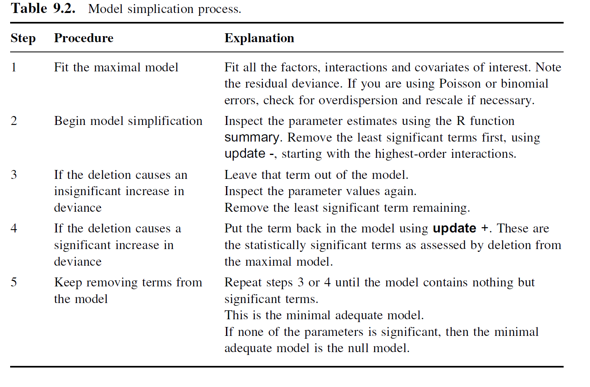

<!--clickable code reveal: 
    http://stackoverflow.com/questions/14127321/how-to-hide-code-in-rmarkdown-with-option-to-see-it
-->
<style>
div.hidecode + pre {display: none}
</style>
<script>
doclick = function(e){
    e.nextSibling.nextSibling.style.display="block";
}
</script>

The goals of this lesson are to introduce univariate modeling using simple and
multivariate Ordinary Least Squares (OLS) regression, and to gain exposure to
the concept and methods of model comparison.

The content from this lesson is modified in part from lessons developed by Jack
Weiss and Jason Fridley. The original lessons can be found at the following
links:

* [Weiss 2012](https://sakai.unc.edu/access/content/group/3d1eb92e-7848-4f55-90c3-7c72a54e7e43/public/docs/lectures/lecture1.htm) 
* [Fridley 2010](http://plantecology.syr.edu/fridley/bio793/lm.html)

## Readings
* Chapters 5, 9-10 in *The R book* (1st ed) by Crawley 
* Chapters 6 in *MASS* (4th ed) by Venables and Ripley


## Lesson Outline
* <a href="#phil">Modeling Philosophy</a>
* <a href="#mod">Model Building and Graphing</a>
* <a href="#sim">Understanding Regression via Simulation</a>
* <a href="#stan">Standardized \(\beta\) coefficients</a>


## <a href="#phil" name="phil">#</a> Modeling Philosophy
One of the simplest and most important ideas when constructing models can be 
stated succinctly:

> "All models are wrong but some models are useful" G.E. Box 

As scientists we have to be on guard that we are not too attached to our
models. Additionally it is often difficult to decide when a model is useful
or not because there are three general reasons for building a model:

* Hypothesis testing
* Exploring data
* Predicting data

These different goals of model building require different approaches and modes
of model evaluation. 
Hypothesis testing is typically geared towards testing a small handful of carefully
crafted ***A PRIORI*** hypotheses. 
In this context they model is typically judged useful if it is statistically 
significant.  
However, many times though the investigator does not have a clear *_a priori_*
hypothesis [(see post at Small Pond Science)](http://smallpondscience.com/2013/06/04/pretending-you-planned-to-test-that-hypothesis-the-whole-time/) 
and is instead examining if a large number of possibly relevant variables are
correlated with a response of interest. 
The goal of this kind of exploratory analysis is to generate hypotheses that can
be more carefully tested with **other datasets** and not with the dataset used
to generate them. 
Unfortunately very frequently and quite misleadingly the correlations that
are found to be strong in the exploratory analysis are then presented in a
hypo-deductive framework as if they were *_a prori_* [(see post on Dynamic Ecology)](https://dynamicecology.wordpress.com/2013/10/16/in-praise-of-exploratory-statistics/).
When using models to make predictions we are typically less concerned about the 
exact variables that are in the model and more concerned that we can predict 
observations not included in the building of the model (i.e., cross-validate
the model).

There are many reasons that p-values and statistical significance are abused in
science. For example, it can be very tempting to report statistics of
significance in many analyses in which you did not have clear *_a prori_* 
hypotheses because often times R will report such statistics without prompting
from the user (e.g., `summary(my_ols_model)`). 
Additionally there is a stigma in many fields of science against exploratory 
analyses in favor of hypothesis testing which pushes some researchers to 
re-frame their analyses as if they are confirmatory rather than exploratory. 
And of course there is pressure during peer-review to only report on 
statistics that are significant. 

You might be wondering why this is a big deal. The reason is that you will inevitably
get good fitting models (high R^2) and statistically significant results (p < 0.05)
if you keep adding variables to a model even if those variables by definition are
independent of the response variable.  [(Freedman 1983)](http://amstat.tandfonline.com/doi/abs/10.1080/00031305.1983.10482729#.Ul17gVAkJPQ).

### The Principle of Parsimony (Occam’s Razor)

The principle of parsimony can be stated succinctly as: 

> the correct explanation is the simplest explanation.

In the context of model building, all else being equal the better model is the 
model with the following properties (Crawley, 2007):

* a model with n−1 parameters to a model with n parameters;
* a model with k−1 explanatory variables to a model with k explanatory variables;
* a linear model to a model which is curved;
* a model without a hump to a model with a hump;
* a model without interactions to a model containing interactions between factors.

Thus model simplification is an important part of finding the most useful model.
A simpler model that explains similar levels of deviance in a response should be
considered a better model. 

Crawley (2007) suggests the following steps for backward model simplification:



These steps are reasonable if one is carrying out an exploratory data analysis; 
however, I do not recommend this approach when formal hypothesis testing is the 
goal of the analysis due to Freedman's paradox as explained above. Additionally,
it may be worth pointing out that model building can proceed from simple to more
complex models as well evaluating with each additional term if it has significantly
increased explanatory power. 


```{r notes, include = FALSE}
# Notes for the future
# Add more code annotation
# Analyze real data first then move to simulation
# Better explain why we are simulating data
```

```{r setup, echo=FALSE}
# setup the R enviornment for kniting markdown doc properly
library(knitr)
opts_knit$set(root.dir='../')
```

We will begin exploring how to build and interpret models in R by using a
data set that a researcher collected 40 plants of common milkweed, *Asclepias
syriaca*, from old fields in northeastern Maine and grew them in a greenhouse;
20 received fertilizer and the other 20 were kept as controls. After two months,
she measured the height of each plant and then collected and weighed all of the
fruit produced by the plant. 

For today's purposes we will examine how fruit mass responses to fertilization, 
and plant height, and if fertilization modulates the effect of plant height on 
fruit mass. 

First let's read load the relevant R packages and the data in and look at the structure of the data

```{r load pkgs}
#install.packages("ggplot2")       # for ggplot
#install.packages("gridExtra")     # for grid.arrange to arrange ggplots
#install.packages("scatterplot3d") # for scatterplot3d to make 3d graphic
#install.packages("MASS")          # for stepAIC to automate model selection 

library(ggplot2)
library(gridExtra)
library(scatterplot3d)
library(MASS)
```

```{r read data}
weeds <- read.csv('http://dmcglinn.github.io/quant_methods/data/milkweeds.csv')
weeds
```

So we can see that this data set is fairly simple. There are two treatments in 
the column called `trt`: `fertilized` and `unfertilized`. And there are two
continuous variables plant height is provided by `plant_ht_cm` and fruit mass by
`fruit_mass_mg`.

Before we dive into the models it is always important to **first visually
examine the patterns in the data set graphically**. This will help to build our
intuition which will guide our modeling and interpretation of the statistics.


>A quick note on graphics. I will primarily use base graphics in this course but
increasingly the R community is moving towards using `ggplot` for graphics.
`ggplot` is a really great set of tools for making bueatiful graphics but it can
be more difficult to understand exactly how it works and how to custumize
graphics. Therefore, I want to expose you to both methods of producing graphics
the simple and clunky base graphics and the elegent and shiny `ggplot` graphics.

First let's examine the effect that fertilizer has on fruit mass using box-and-whisker plots.

```{r boxplot}
boxplot(fruit_mass_mg ~ trt, data = weeds, xlab='Treatment', 
        ylab = 'Fruit mass (mg)')
```

Above we used the function `boxplot` to produce a modified box-and-whisker plot.
In this case we used the `formula` argument to specify the relationship we
wished to display in which the LHS is the dependent variable and the RHS is the
independent variable. The argument `data` tells the function where to look for
the variables that I specified in the `formula` argument. Lastly, `xlab` and 
`ylab` allow you to specify the labels for each axis. 

In the graphic, the box represents the inner quartile range (IQR), the
line is the median, and the whiskers represents either the minimum or maximum or
1.5 * IQR which ever is closer to the median value. Outliers are defined as
points that fall outside of the whiskers and will be shown as points.

I prefer box-and-whisker plots because they help to represent the data in a 
summarized way that does not make distributional assumptions. It is also 
easy to calculate the values used in the boxplot using the function `quantile`

```{r quantile}
quantile(weeds$fruit_mass_mg[weeds$trt == 'fertilized'])

```

Now let's make the same graphic using `ggplot`

```{r ggboxplot}
ggplot(data = weeds) + 
  geom_boxplot(mapping = aes(x = trt, y = fruit_mass_mg)) +  
  labs(x = 'Treatment', y = 'Fruit mass (mg)') 
```

Technically this is the same graphic as produced by base but you can see that
the R code is a bit more cryptic.

Let's break it down line by line: `ggplot(data = weeds) +` spawns a `ggplot` graphic and specifies that the data will be provided by the object `weeds`. Now we can simply refer to column names
of `weeds` in the remainder of the plotting call. 

The next line: `geom_boxplot(mapping = aes(x = trt, y = fruit_mass_mg)) +` specifies the geometry of the graphic in this case a boxplot, there are many other that can be specified in `ggplot`. The geometry function requires a 
few arguments including how to map data on to the graphic using the argument
`mapping`. The mapping is usually wrapped in the function `aes` which provides an aesthetically pleasing rendering of the data on the graphic, `aes` requires
and `x` and `y` variables. 

The last line: `labs(x = 'Treatment', y = 'Fruit mass (mg)')` provides the axis
labels. 

Note that each line that is not the last line of the `ggplot` function ends with
a plus sign `+` this tells R that you are specifying more options to the plot. 

The additional overhead of the understanding this somewhat cryptic R code comes 
when you want to quickly make nice graphics across multiple factors or splits
or a data set and when you want more complex geometries which the `ggplot` 
developers have already created. 

We are only going to touch on the capacities of `ggplot` here. Here are a couple
of great places to learn more about `ggplot`

 * <https://ggplot2.tidyverse.org/>
 * [*R for Data Science*](https://r4ds.had.co.nz/) by Garrett Grolemund
and Hadley Wickham

From our boxplot we can see that fertilizer does seem to increase the mass of the milkweed fruits. Let's also examine if plant height seems to influence 
fruit mass. 

Since fruit mass and plant height are both continuous variables we will use a 
scatterplot to display their relationship. 

```{r simple scatter}
plot(fruit_mass_mg ~ plant_ht_cm, data = weeds, xlab = 'Plant height (cm)',
     ylab = 'Fruit mass (mg)')
```

Like the `boxplot` function the `plot` function allows you to use a `formula`
argument to specify the variables included in the plot. 

From our plot we can see that taller plants do seem to produce more fruit mass. 

Let's visually examine if fertilizer modifies how fruit mass response to plant 
height

```{r simple int}
plot(fruit_mass_mg ~ plant_ht_cm, data = weeds, type = 'n', 
     xlab = 'Plant height (cm)', ylab = 'Fruit mass (mg)')
points(fruit_mass_mg ~ plant_ht_cm, data = weeds, subset = trt == "fertilized",
       pch = 1, col = 'red')
points(fruit_mass_mg ~ plant_ht_cm, data = weeds, subset = trt == "unfertilized",
       pch = 2, col = 'blue')
legend('topleft', c('Fertilized', 'Unfertilized'), col = c('red', 'blue'), 
       pch = c(1, 2), bty = 'n')
```

Now we have a graphic where we have different colors and symbols for the 
fertilized and unfertilized points. 

Let's add a smoother so that we can better see if the different fertilization 
regimes have different functional forms. There are many options for smoothing
functions to choose from in R but for simplicity we'll use the function `lowess`
which is a locally-weighted polynomial regression. 

```{r simple int smooth}
plot(fruit_mass_mg ~ plant_ht_cm, data = weeds, type = 'n', 
     xlab = 'Plant height (cm)', ylab = 'Fruit mass (mg)')
points(fruit_mass_mg ~ plant_ht_cm, data = weeds, subset = trt == "fertilized",
       pch = 1, col = 'red')
lines(lowess(weeds$plant_ht_cm[weeds$trt == 'fertilized'],
             weeds$fruit_mass_mg[weeds$trt == 'fertilized']),
      lty = 1, col = 'red')
points(fruit_mass_mg ~ plant_ht_cm, data = weeds, subset = trt == "unfertilized",
       pch = 2, col = 'blue')
lines(lowess(weeds$plant_ht_cm[weeds$trt == 'unfertilized'],
             weeds$fruit_mass_mg[weeds$trt == 'unfertilized']),
      lty = 2, col = 'blue')
legend('topleft', c('Fertilized', 'Unfertilized'), col = c('red', 'blue'), 
       pch = c(1, 2), lty = c(1, 2), bty = 'n')

```

##### **Question**
Based on the graphic above does it appear that fertilization modulates the 
effect of plant height on fruit mass? In statistics we would consider such an
effect and **interaction effect**. 

<div class="hidecode" onclick="doclick(this);">[Show answer]</div>
```
There does not appear to be an interaction effect between fruit mass and
fertizlation because the two smoothers look roughly parallel to one another.
This suggests that a model in which just two main effects: treatment and plant
height but no interaction effect is likely going to provide the best
approximation to the data without over fitting. 
```
Let's create the same graphic but using `ggplot`

```{r gg simple int}
ggplot(data = weeds, mapping = aes(x = plant_ht_cm, y = fruit_mass_mg)) + 
  geom_point(mapping = aes(color = trt)) +
  geom_smooth(mapping = aes(linetype = trt, color = trt), method = 'loess') +
  scale_color_manual(values = c("red", "blue")) +
  theme_classic()
```

A few quick points about this `ggplot` call. 

* rather than specify the mapping of the `x` and `y` for each `geom_*` we simply
specify them once when setting up the graphic in the first `ggplot()` call
* Note the usage of `manual_color()` - this is generally note needed as 
`ggplot`'s default colors are usually pretty attractive. I'm not sure why the 
packages is showing 'blue' as 'purple'

##### Excercise
Modify the `ggplot` call so that the `x` and `y` axes are properly labeled.
<div class="hidecode" onclick="doclick(this);">[Show answer]</div>
```{r gg excercise}
ggplot(data = weeds, mapping = aes(x = plant_ht_cm, y = fruit_mass_mg)) + 
  geom_point(mapping = aes(color = trt)) +
  geom_smooth(mapping = aes(linetype = trt, color = trt), method = 'loess') +
  scale_color_manual(values = c("red", "blue")) +
  labs(x = 'Plant height (cm)', y = 'Fruit mass (mg)') +
  theme_classic()
```

## <a href="#mod" name="mod">#</a> Model Building and Graphing

Now that we've visually explored the relationships in the milkweed data set, and
we have developed some intuition about how we might want to approach this data set
let's actually develop some statistical regression models to explain the variation in 
fruit mass. 

### Ordinary Least Squares Regression

Ordinary Least Squares (OLS) regression is one of the most commonly used models
in statistics. It attempts to approximate the response variable *y* using a
linear combination of explanatory variables **x**. We can express OLS regression
algebraically as: 

$$y_i = \beta_0 1 + \beta_1 x_{i1} + \cdots + \beta_p x_{ip} + \varepsilon_i, \qquad i = 1, \ldots, n, \qquad \varepsilon \sim N(0, \sigma^2) \qquad \text{(equ. 1)}$$

Let's break equ. 1 down into its parts: 

* $y_i$ is the *i*-th value of the response variable
* $\beta_0$ is the *y*-intercept
* the $\beta$ values are the partial slopes of the *p* explanatory variables.
* $\varepsilon$ represents the normally distributed error with mean of 0 and 
variance equal to $\sigma^2$

One of the core things to take away from equ. 1 is that regression equations
always have one or more error terms. How this error is specified (e.g., Normal
error, Binomial error, Poisson error) is the key way different regression
methods differ from one another. Another important point about the error term is
that in OLS each of the *n* samples are assumed to be **independent and
identically distributed** (iid) from one another. Other methods of regression we
look examine (e.g., spatial regression) will not make this same assumption and
will specify how samples co-vary with one another. 

Taken together it can be seen that OLS regression has a number of key assumptions

1. Linearity such that *y* is a linear combination of the *x*-variables.
Because the *x* variables may be transformed this is a less restrictive 
assumption then it may seem. 
2. No error in the independent variables.
3. Homoscedasticity of errors which means that error around the regression line
is equal across the range of *x* values.
4. Independence of errors such that the direction and magnitude of error is not
correlated between samples. 

As you read those assumptions you may be correctly thinking to yourself that 
those assumptions are almost never met in most situations. We'll examine in a 
moment using simulated data how critical violations of some of those assumptions
are. 

### Model Heirarchy

In our greenhouse data set we have several different models we could examine: 

#### Intercept only null model 

There is the minimal intercept only model

$$\mathbf{y} = \beta_0 + \varepsilon$$
This model essentially just uses the mean of *y* as a predictor of *y*. This 
may seem silly but this is essentially what you compare all more complex models
against. 

```{r null model}
null_mod = lm(fruit_mass_mg ~ 1, data = weeds)
null_mod
mean(weeds$fruit_mass_mg)
```

In the above R code, `lm` specifies this is a linear model, we used the `formula`
specification just as we did when using `boxplot` and `plot` but in this case
the RHS of the equation is just a 1 indicating that just an intercept only model
is being specified. 

It is clear from the output of the R code this model only has the intercept and that is equal to the mean of the response variable. 

Let's examine this model graphically

```{r null model graphic}
plot(fruit_mass_mg ~ 1, data = weeds)
abline(null_mod, lwd = 2)
abline(h = mean(weeds$fruit_mass_mg), col = 'red', lty = 2, lwd = 2)
```

Note above that the x-axis is just an index of the 40 samples. The function 
`abline` is useful to specifying regression (`reg=`), horizontal (`h=`), and vertical lines (`v=`).

#### Main effect models 

A main effect model is a model that includes at least one independent variable: 

$$y = \beta_0 + \beta_1x+\varepsilon$$

We can develop single *main effect* models that include either treatment or 
plant height as such in R:

```{r main effect models}
trt_mod = lm(fruit_mass_mg ~ trt, data = weeds)
# alternatively we can just update null_mod
trt_mod = update(null_mod, . ~ . + trt)
ht_mod = update(null_mod, . ~ . + plant_ht_cm)
trt_mod
ht_mod
```

Let's take a closer look at the `trt_mod` which includes the main effect due to 
treatment. Note that only one of the levels of treatment is provided as a 
coefficient. In this case it is `unfertilized`. To better understand this you 
need to consider how factor variables are included in regression models. A 
categorical variable is encoded in R into a set of orthogonal contrasts.

```{r}
levels(weeds$trt)
contrasts(weeds$trt)
```

In this case we have a factor `trt` that only has two levels so it only requires
one binary variable because if a sample is not fertilized then it must be
unfertilized. That may seem a little strange but just remember that if you have
a factor with *k* levels then you need *k* - 1 binary variables to specify that
factor as a set of orthogonal contrasts. This explains why the treatment variable
only requires a single regression coefficient. 

Sometimes we have factors that are ranked such as low, medium, high. In this
case the variable is called **ordinal** as opposed to our **nomial** treatment 
variable. The contrasts of ordinal variables are not as simple to specify and 
typically a Helmert polynomial contrasts are used. 

Let's examine these models graphically.

```{r}
par(mfrow=c(1,2))
plot(fruit_mass_mg ~ trt, data = weeds, xlab = 'Treatment',ylab = 'Fruit mass (mg)')
abline(trt_mod)

plot(fruit_mass_mg ~ plant_ht_cm, data = weeds, 
     xlab = 'Plant height (cm)', ylab = 'Fruit mass (mg)')
abline(ht_mod)

```

The first panel of this graphic doesn't quite look correct because the regression
line is not intersecting the center of the boxplots which is what we would 
expect. This is because by default 
R assigns the first level of the treatment factor an x-value of 1 and the second level of the factor a value of 2. Therefore when the regression line is added to the 
plot it is plotting the y-intercept (which is the mean value of the fertilized
group) off the graph to the left one unit. To correct this we have to 
build the graph from scratch a bit more carefully making sure that the fertilized
group is plotted an an x-axis value of 0 so that the regression line intersects that
groups properly.

```{r}
par(mfrow=c(1,2))
plot(0:1, 0:1, type='n', ylim = range(weeds$fruit_mass_mg), axes = F,
     xlim = c(-0.25, 1.25),
     xlab = 'Treatment', ylab = 'Fruit mass (mg)', frame.plot = T)
points(rep(0, 20), weeds$fruit_mass_mg[weeds$trt == 'fertilized'])
points(rep(1, 20), weeds$fruit_mass_mg[weeds$trt == 'unfertilized'])
axis(side = 1, at = 0:1, labels = c('fertilized', 'unfertilized'))
axis(side = 2)
abline(trt_mod)

plot(fruit_mass_mg ~ plant_ht_cm, data = weeds, 
     xlab = 'Plant height (cm)', ylab = 'Fruit mass (mg)')
abline(ht_mod)

```

This is a good example of how `ggplot` can simplify things if you know the 
correct command. In this case the command is a bit cryptic we need to 
specify in the mapping of the points that the argument `group = 1`. To be 
honest I'm not exactly sure what this means but a search of the internet 
suggested it would work so viola! 

```{r}
p1 <- ggplot(data = weeds,
             mapping = aes(x = trt, y = fruit_mass_mg, group = 1)) + 
      geom_point() + 
      geom_smooth(method = 'lm') +
      labs(x = 'Treatment', y = 'Fruit mass (mg)')

p2 <- ggplot(data = weeds, 
             mapping = aes(x = plant_ht_cm, y = fruit_mass_mg)) + 
      geom_point() + 
      geom_smooth(method = 'lm') + 
      labs(x = 'Plant height (cm)', y = 'Fruit mass (mg)')

grid.arrange(p1, p2, nrow = 1)

```

Note above that the function `grid.arrange` is used to make multi-panel `ggplots`
and it is a part of the `gridExtra` package. 

#### All main effects model

Of course we can also specify a model that includes both main effects

$$y = \beta_0 + \beta_1x + \beta_2z + \varepsilon$$

In R we would use: 

```{r combo main effects}
main_mod = lm(fruit_mass_mg ~ trt + plant_ht_cm, data = weeds)
main_mod
```

This particular model specifies two parallel regression lines that only differ
in their y-intercept based on whether or not they were fertilized.

```{r}
xrange = range(weeds$plant_ht_cm)

plot(fruit_mass_mg ~ plant_ht_cm, data = weeds, type = 'n', 
     xlab = 'Plant height (cm)', ylab = 'Fruit mass (mg)')
points(fruit_mass_mg ~ plant_ht_cm, data = weeds, subset = trt == "fertilized",
       pch = 1, col = 'red')
# add the fitted regression line using two points at either end of the range of x 
lines(xrange, 
      predict(main_mod, 
              newdata = data.frame(plant_ht_cm = xrange, trt = "fertilized")),
      col = 'red', lty = 1)
points(fruit_mass_mg ~ plant_ht_cm, data = weeds, subset = trt == "unfertilized",
       pch = 2, col = 'blue')
lines(xrange, 
      predict(main_mod, 
              newdata = data.frame(plant_ht_cm = xrange, trt = "unfertilized")),
      col = 'blue', lty = 2)
legend('topleft', c('Fertilized', 'Unfertilized'), col = c('red', 'blue'), 
       pch = c(1, 2), lty = c(1, 2), bty = 'n')

```

Above in the R code we used a new function `predict()`. This function is useful
for taking a fitted model and using it to predict values. In this case we use
this feature to predict where two points fall along the x-axis so that we can
connect them with lines and thus form the fitted regression lines. One of the
more difficult arguments to `predict()` to understand is the `newdata` argument.
This is essentially a `data.frame` that must have the variables in the model
included as column names. So in this case must have the variables `plant_ht_cm`
and `trt` in `newdata`.

Another way to think about this model is that it is specifying a 3d plane that
can fit through the data. 

```{r scatterplot3d}
s3d <- scatterplot3d(weeds[ , c('trt', 'plant_ht_cm', 'fruit_mass_mg')], 
                     type = 'h', color = 'blue', angle = 65, pch = 16, 
                     lab = c(3, 5), xlim = c(0, 3),
                     x.ticklabs = c('', 'fertilized', 'unfertilized', ''), 
                     box = F) 
# Add regression plane
s3d$plane3d(main_mod)
```

Again above it is a little fussy to make this graph because of the factor.


#### Interaction effect model

Lastly the most complex typical model that we would specify based on our 
graphical exploration would also be a model that includes an **interaction effect**. An interaction effect is an effect in which one variable influences
the effect of another variable on the response. 

$$y = \beta_0 + \beta_1x + \beta_2z + \beta_3xz + \varepsilon$$


```{r interaction model}
int_mod = lm(fruit_mass_mg ~ trt + plant_ht_cm + trt:plant_ht_cm,
              data = weeds)
# alternatively we can use * as short hand
int_mod = lm(fruit_mass_mg ~ trt * plant_ht_cm, data = weeds)
int_mod
```

Graphically the easiest way to consider this model is that it specifies separate
regression lines for each level of fertilization that differ in both their 
y-intercept and slope. 

```{r}
plot(fruit_mass_mg ~ plant_ht_cm, data = weeds, type = 'n', 
     xlab = 'Plant height (cm)', ylab = 'Fruit mass (mg)')
points(fruit_mass_mg ~ plant_ht_cm, data = weeds, subset = trt == "fertilized",
       pch = 1, col = 'red')
xrange = range(weeds$plant_ht_cm[weeds$trt == "fertilized"])
lines(xrange, 
      predict(int_mod, 
              newdata = data.frame(plant_ht_cm = xrange, trt = "fertilized")),
      col = 'red', lty = 1)
points(fruit_mass_mg ~ plant_ht_cm, data = weeds, subset = trt == "unfertilized",
       pch = 2, col = 'blue')
xrange = range(weeds$plant_ht_cm[weeds$trt == "unfertilized"])
lines(xrange, 
      predict(int_mod, 
              newdata = data.frame(plant_ht_cm = xrange, trt = "unfertilized")),
      col = 'blue', lty = 2)
legend('topleft', c('Fertilized', 'Unfertilized'), col = c('red', 'blue'), 
       pch = c(1, 2), lty = c(1, 2), bty = 'n')
```

##### **Excercise**

Try to come up with the `ggplot` code to graphically depict the interaction 
effect model (clue: we made essentially this graphic above but with a smoother so
if you need a reminder of how to structure the code look above). 

<div class="hidecode" onclick="doclick(this);">[Show answer]</div>
```{r}
ggplot(weeds, mapping = aes(x = plant_ht_cm, y = fruit_mass_mg)) +
  geom_point(aes(color = trt)) +
  geom_smooth(aes(color = trt, linetype = trt), method = 'lm', se = F) + 
  labs(x = 'Plant height (cm)' , y = "Fruit mass (cm)")
```

##### **Question**

In the above graphic do you see good evidence that the additional complexity of the interaction effect model is warranted? 

<div class="hidecode" onclick="doclick(this);">[Show answer]</div>
```
The interaction effect model allows for the slopes of the lines to differ 
based on fertilization but it can be seen that the best fit lines appear to have
very similar slopes which suggests that the added complexity is likely not 
warrented
```

## Tabular model interpretation

Now that we've build our two models let's examine the model fits and the 
statistical significance of the explanatory variables. 

```{r}
summary(trt_mod)
# becasue trt is a factor lets also examien the anova output
anova(trt_mod)
```

The function `summary` provides several useful pieces of information for linear
models. The coefficients table:

```
Coefficients:
                Estimate Std. Error t value Pr(>|t|)    
(Intercept)      20.1000     0.5557  36.171  < 2e-16 ***
trtunfertilized  -3.3905     0.7859  -4.314  0.00011 ***  
```

which provides the estimate, standard error, t-statistic, and p-value for:
 
* \(\hat{\beta_0}\) the y-intercept - 1st row of the table
* \(\hat{\beta_1}\) the slope of the regression line - 2nd row of the table

The p-values can be used to assess statistical significance, and
the t-statistics provide a measure of effect size.

**Note: most of the time we are not interested in the test of the intercept**

In addition to the coefficient table several statistics for 
the entire model are also provided:

```
Residual standard error: 2.485 on 38 degrees of freedom
Multiple R-squared:  0.3288,	Adjusted R-squared:  0.3111 
F-statistic: 18.61 on 1 and 38 DF,  p-value: 0.0001099
```

The multiple R-squared and adjusted R-squared provide estimates of variance 
explained. 
The later statistic adjusts for the number of variables included in the model.
The F-statistic is a ratio of the mean sum of squares for the model to the 
sum of squares of the residuals (i.e., the ratio of explained variance to 
unexplained variance). The p-value associated with the F-statistic provides
a means of examining the statistics significance of the entire model. 

**Note: in this specific model because only a single explanatory variable is 
included the overall model *p*-value is identical to the *p*-value reported
for `trt` in the coefficients table.**

The function `anova` reports the analysis of variance table

```
Response: fruit_mass_mg
          Df Sum Sq Mean Sq F value    Pr(>F)    
trt        1 114.95 114.955  18.614 0.0001099 ***
Residuals 38 234.68   6.176
```

The first column lists the degrees of freedom which indicate that our for 
two leveled factor `trt` that only one degree of freedom is lost. An additional
degree of freedom is lost to estimate the variance of the error term, thus the
residuals Df = 38 when *n* = 40. The second column provides the sums of square
differences for the trt and residuals these are also know as the explain and 
unexplained variances. The F-value is the ratio of unexplained to explained 
variance after taking degrees of freedom into consideration. 

```{r}
# F is explained SS / (unexplained SS / df)
114.95 / (234.68 / 38)
```

Note that the *p*-value derived from the *F*-test is identical to the *t* 
reported for in the coefficient table returned by `summary`. 

So the tabular output of the treatment main effect model indicates that 
including just treatment explains 31% of the variance which is a statistically 
significant amount of variance.

Now let's examine the plant height main effect model

##### **Question**

Extract and interpret the model statistics for the plant height only model.

<div class="hidecode" onclick="doclick(this);">[Show answer]</div>
```{r}
summary(ht_mod)
# variance explained is 30% and overall model is statistically significant
# this suggests that the treatment effect is stronger than the plant height effect
```

## <a href="#comp" name="comp">#</a> Model comparisons

Our graphical exploration suggested that the model that included both treatment
and plant height would have the most support let's undertake some formal model
comparison. 

### Adjusted $R^2$

A simple but somewhat cumbersome approach is just to compare the model output from 
`summary`

```{r}
summary(main_mod)
summary(int_mod)
```

From this we can see that two models have identical $R^2$ values which usually would
be surprising because we typically expect more complex models to have higher raw
variance explained estimates. This isn't surprising to use because we already 
graphically inspected the models and concluded there was little support for an
interaction effect. We should also compare the adjusted $R^2$ which adjusts the estimate of variance explained based on how much we would expect the
variance explained if purely noise variables were added. In this case the 
more complex interaction effect model has a lower adjust $R^2$ suggesting that
it is not the most parsimonious model.

### Log-ratio tests

We can also use the function `anova` to carry out log-ratio tests on nested models.
Nested models are models in which the more complex model has all of the same
parameters as the simple model and then some additional ones. 

```{r}
anova(main_mod, int_mod)
```

The ANOVA table indicates that the interaction model does not explain 
significantly more variance - this case this was a silly test to run because
we already could have predicted this result based on the adjusted $R^2$ 
values. 

### AIC model comparison

In the biological sciences a popular way of comparing models is to use a 
penalized log likelihood criteria such as as the  Akaike information criterion (AIC) or the Bayesian information criterion (BIC). Unlike the ANOVA comparisons AIC
and BIC can be used to compare models that are not nested. 
The formula for AIC is: 

$$\mathrm{AIC} = - 2\log(\hat L) + 2k $$

where $\hat L$ is the likelihood of the model and $k$ is the number of parameters
in the model. The AIC index ranks models both on their degree of fit but also on
their complexity. A small value of AIC indicates a better model and thus models
with more complexity (i.e., more parameters) and thus larger $k$ value, but equal likelihood are considered worse models (higher AIC). 

**Note: the exact value of the AIC model is not important but the differences
between models are**

```{r}
# examine the AIC scores of all the models we have considered
# smaller number is better
AIC(null_mod)
AIC(trt_mod)
AIC(ht_mod)
AIC(main_mod)
AIC(int_mod)
```

So as you can see all the models are better than the null model, but the 
main effect only model is considered the best model. If two models are within
2 units of the AIC index then they are considered roughly equivalent models. 

There is another function called `extractAIC` which returns different values
for AIC because it uses different additive constants; however, the differences
between the models are still the same

```{r}
AIC(main_mod)
extractAIC(main_mod)[2]

AIC(main_mod) - AIC(int_mod)
extractAIC(main_mod)[2] - extractAIC(int_mod)[2]

```

### Automated model selection

The approach we have taken above of a careful examination of the graphical 
patterns in the data set followed by careful and rational model comparison is 
not always possible when the models being compared are quite large. 

```{r}
# run a stepwise regerssion analysis on the full model.
stepAIC(int_mod)
```

As you can see above this approach results in the same model that we found 
to be the best the main effects model. Do note that `stepAIC` internally uses
the function `extracAIC` to compute the AIC values. 

## Model diagonstics

Now that we think we have a sufficient model we should carefully examine it to 
make sure it meets the assumptions of OLS regression. This is particularly 
important if we are going to use the *p*-values for rigorous hypothesis 
testing. 

It is easy to examine the diagnostics of the model visually using `plot`

```{r}
par(mfrow = c(2,2))
plot(int_mod)
```

The top left and bottom left panels both  suggests that the assumption of **homoscadisticity** holds. 
The top right panel suggests that the residuals are **normally distributed**. 
The bottom right panel suggests that there are not large outliers that are 
having a disproportionate effect on the regression. 

## <a href="#sim" name="sim">#</a> Understanding Regression via Simulation

R is an excellent environment for learning about how models work in part because
of the ease to generate data with known properties. This provides us the ability
to not only check that a model is performing as expected but also helps to 
indicate strengths and weaknesses of various model fitting and effect size 
strength measures. 

```{r}
#generate data for example
set.seed(10) # this is done so that the same results are generated each time
x1 = runif(900)
x2 = rbinom(900, 10, .5)
x3 = rgamma(900, .1, .1)

#organize predictors in data frame
sim_data = data.frame(x1, x2, x3)
#create noise b/c there is always error in real life
epsilon = rnorm(900, 0, 3)
#generate response: additive model plus noise, intercept=0
sim_data$y = 2*x1 + x2 + 3*x3 + epsilon
```

Above we have defined response variable `y` as a linear function of the three
simulated independent variables (the `x` variables). Epsilon refers to the 
error in the model and in line with OLS regression assumptions we have made 
this is a normally distributed variable centered at zero.

Now that we have simulated our data let's examine how we build OLS models in 
R and plot the result.

```{r}
#First we will demonstrate the simplest possible model 
#the intercept only model
mod = lm(sim_data$y ~ 1)
mod 
summary(mod)
#Note that the estimate for the intercept is equilalent to the mean of y
mean(sim_data$y)
#simple linear regression with x1 as predictor
mod1 = lm(y ~ x1, data=sim_data)
#plot regression line and mean line
plot(y ~ x1, data=sim_data)
abline(h=mean(sim_data$y), col='pink', lwd=3)
abline(mod1, lty=2)
#simple linear regression with x3 as a predictor
mod3 = lm(y ~ x3, data=sim_data)
#graph regression line and mean line
plot(y ~ x3, data=sim_data)
abline(mod3)
abline(h=mean(sim_data$y), col='pink', lwd=2)
legend('topleft', c('OLS fit', 'mean'), col=c('black', 'pink'), lty=1, lwd=c(1,2))
```

Now that we've build our two models let's examine the model fits and the 
statistical significance of the explanatory variables. 

```{r}
summary(mod1)
```

We noticed that there was a large outlier in the previous plot. Let's run model 
diagnostics to see if we should consider dropping that variable. 

```{r}
par(mfrow=c(2,2))
plot(mod1)
par(mfrow=c(1,1))
```

From the diagnostic plots you can see observations 26, 85, and 88 are consistently
identified as having abnormally large residual values (Residuals vs Fitted plot),
they cause the residuals to diverge from an expectation under normality (Normal Q-Q plot),
and lastly they exert too much leverage (i.e., control on the slope of the 
regression, Residuals vs Leverage plot). 

Here is a case where if this was an actual analysis we would check to make sure 
these values are not mistakes. Let's drop these points and examine the changes
in the model statistics. 

```{r}
sim_data_sub = sim_data[-c(26, 85, 88), ]
#verify that one observation was removed
dim(sim_data)
dim(sim_data_sub)
#refit model to reduced data
mod3_sub = lm(y ~ x3, data=sim_data_sub)
summary(mod3)
summary(mod3_sub)
```

So it appears that \(R^2\) is highly sensitive to outliers but the \(\beta\) 
coefficients are more robust. 

##### **Excercise** 
Create a single plot that displays the model of y given x3 before and after the
outliers were removed. How much to they visually differ from one another.
Modify the arguments to `abline()` including `lty` and `lwd`.

<div class="hidecode" onclick="doclick(this);">[Show answer]</div>
```{r}
plot(y ~ x3, data=sim_data)
points(y ~ x3, data=sim_data_sub, col='dodgerblue', pch=19)
abline(mod3)
abline(mod3_sub, col='dodgerblue', lwd=2)
legend('topleft', c('fit with all data', 'fit w/o outliers'), 
       col=c('black', 'dodgerblue'), pch=c(1, 19), lty=1, 
       lwd=c(1,2), bty='n')
```

### <a href="#mult" name="mult">#</a> Multiple regression 

So far we have only examined models with a single variable but by design we
know that y is influenced by three variables. Let's include all the relevant
explanatory variables in one model now. 

```{r}
mod_main = lm(y ~ x1 + x2 + x3, data=sim_data)
summary(mod_main)
coefficients(mod_main)
```

Notice that in the output above the coefficient estimates are close to 
what we set them at when we created the variable `y`. 


## <a href="#stan" name="stan">#</a> Standardized \(\beta\) coefficients
A standardized \(\beta\) or regression coefficient is simply the 
\(\beta\) estimate from a regression on standardized variables. The typical way
of standardizing a variable is to subtract its mean and divide it by its standard
deviation. This transformation results in a variable a mean of zero and a
standard deviation of one. There are other ways to standardize a variable but
this is by far the most common.

One reason for standardizing variables is that you can interpret the \(\beta\) estimates as partial correlation coefficients. In other words now that the
variables are standardized you can compare how correlated they are to the 
response variable using their regression coefficients. Below is a demo of this.

```{r}
## We will use this function to plot the data and correlations 
panel.cor <- function(x, y, digits = 2, prefix = "", cex.cor=3, ...)
{
    usr <- par("usr"); on.exit(par(usr))
    par(usr = c(0, 1, 0, 1))
    r <- abs(cor(x, y))
    txt <- format(c(r, 0.123456789), digits = digits)[1]
    txt <- paste0(prefix, txt)
    if(missing(cex.cor)) 
        cex.cor <- 0.8/strwidth(txt)
    text(0.5, 0.5, txt, cex = cex.cor)
}
```

Before standardizing variables it is worthwhile to highlight that the 
relationship between correlation and regression statistics. Specifically, 
the t-statistic from a simple correlation coefficient is exactly what is
reported for the \(\beta_1\)  coefficient in a regression model.

```{r}
cor.test(sim_data$y, sim_data$x1)$statistic
summary(lm(y ~ x1, data=sim_data))$coef
```

The \(\beta\) coefficient reported by the regression is not equal to the
correlation coefficient though because the \(\beta\) is in the units of the 
\(x_1\) variable (i.e., it has not been standardized). Now let's use the function 
`scale()` to standardize the independent and dependent variables. 

```{r}
sim_data_std = data.frame(scale(sim_data))

mod = lm(y  ~ x1 + x2 + x3, data=sim_data)
mod_std = lm(y  ~ x1 + x2 + x3, data=sim_data_std)
round(summary(mod)$coef, 3)
round(summary(mod_std)$coef, 3)
cor(sim_data$y, sim_data$x1)
cor(sim_data$y, sim_data$x2)
cor(sim_data$y, sim_data$x3)

```

Notice that above the t-statistics and consequently the p-values between `mod`
and `mod_std` don't change (with the exception of the intercept term which is
always 0 in a regression of standardized variables). This is because the 
t-statistic is a pivotal statistic meaning that its value doesn't depend on the
scale of the difference. 

Additionally notice that the individual correlation coefficients are very 
similar to the \(\beta\) estimates in `mod_std`. Why are these not exactly the same?
Here's a hint - what would happen if their was strong multicollinarity between
the explanatory variables?

Let's plot the variables against one another and also display their individual
Pearson correlation coefficients to get a visual perspective on the problem

```{r}
pairs(sim_data, lower.panel = panel.smooth, upper.panel = panel.cor)
```

### <a href="#inter" name="inter">#</a> Interaction effects

```{r}
# you can build the model by writing out every interaction
lm(y ~ x1 + x2 + x3 + x1*x2 + x1*x3 + x2*x3 + x1*x2*x3, data=sim_data)
# or you can simply update the main effects model
mod_full = update(mod_main, ~ . + x1*x2*x3)
summary(mod_full)
```

### Model comparison

```{r}
# we can carry out a nested model comparison
anova(mod_main, mod_full)

# examine the AIC scores of the two models, smaller number is better
AIC(mod_full)
AIC(mod_main)

# run a stepwise regerssion analysis on the full model.
stepAIC(mod_full)
```